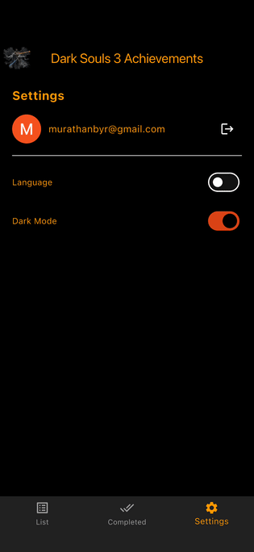
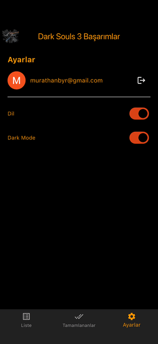

# Flutter Portfolio

A curated collection of Flutter projects showcasing clean architecture, responsive UI, and real-world integrations.

---

## 🚀 Overview

This repository highlights my hands-on Flutter work, focusing on production-ready patterns and maintainable code. It includes UI experiments, feature-driven modules, and integrations commonly used in modern mobile apps.

**Tech Stack:** Flutter • Dart • Firebase • REST APIs

---

## 🎬 Demo

<p align="center">
  
    

</p>

---

## 📱 Screenshots

<p align="center">
  
  
</p>

---

## 🧩 Key Features

* Clean, feature-first architecture
* Reusable and composable widgets
* Firebase Authentication
* Localization (i18n)
* Responsive layouts (mobile-first)

---

## 🛠️ Getting Started

```bash
flutter pub get
flutter run
```

---

## 📂 Project Structure

```text
lib/
 ├── core/          # shared utilities, theme, routing
 ├── features/      # feature-based modules
 ├── models/        # data models
 ├── services/      # API & Firebase services
 └── main.dart
```

---

## 🔒 Security & Configuration

Sensitive files are excluded from version control via `.gitignore`:

* `google-services.json`
* `GoogleService-Info.plist`
* `.env`

Environment-specific values should be provided locally.

---

## 👤 Author

**Murathan Bayar**
Flutter Developer

* GitHub: [https://github.com/murathanb](https://github.com/murathanb)
* LinkedIn: [https://linkedin.com/in/Murathanb](https://linkedin.com/in/Murathanb)

---

## ⭐ Notes

This repository is actively maintained and updated as I continue building with Flutter.
